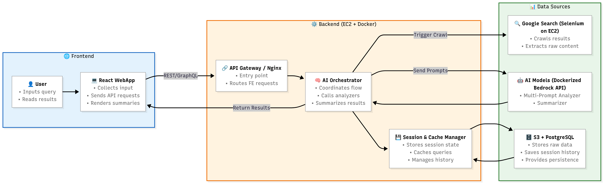
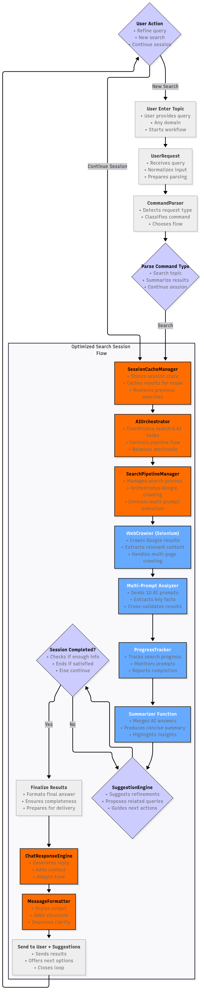

# 📖 AI Search Summarizer App

**Live Demo:** 👉 [https://www.tanly.blog](https://www.tanly.blog) 👈  

## 🚀 Introduction
AI Search Summarizer is a **smart search application** that allows users to enter any topic, the system will:  
1. **Automatically crawl Google** (using Selenium).  
2. **Send multiple prompts in parallel (10 prompts)** to AI for the most accurate information.  
3. **AI Summarizer** aggregates and condenses the content into a short, easy-to-read result.  

The application saves time for research while ensuring more complete and accurate information compared to just reading raw search results.  

---

## 🏗 System Architecture





---

## ⚙️ Main Components

### 🌐 Frontend
- **React WebApp**
  - Collects queries from users.  
  - Sends requests to the backend.  
  - Displays summarized results + next query suggestions.  

### ⚙️ Backend (EC2 + Docker)
- **API Gateway / Nginx**: receives requests from FE, routes to services.  
- **AI Orchestrator**: coordinates the pipeline, calls crawler + AI.  
- **Session & Cache Manager**: manages session, caches queries for optimization.  

### 📊 Data Sources
- **Google Search (Selenium on EC2)**: crawls data from Google Search.  
- **AI Models (Dockerized / Bedrock API)**: runs multi-prompt analyzer + summarizer.  
- **S3 + PostgreSQL**: stores crawled data, query history, and session states.  

---

## 🔄 Workflow
1. User enters a query on the **Frontend**.  
2. Request is sent to **Backend (API Gateway)**.  
3. **AI Orchestrator** triggers the **Selenium Crawler** to fetch Google Search data.  
4. Collected content is sent to the **Multi-Prompt Analyzer** (10 prompts in parallel).  
5. Results are aggregated by the **Summarizer** into a short summary.  
6. Final result + suggestions are returned to the **Frontend**.  

---

## 🐳 Deployment with Docker + EC2

### 1. Requirements
- AWS EC2 instance (Ubuntu 22.04).  
- Docker & Docker Compose installed.  
- Domain + SSL (via Nginx).  

### 2. Clone the project
```bash
git clone https://github.com/your-org/ai-search-summarizer.git
cd ai-search-summarizer
```

### 3. Run with Docker Compose
```bash
docker-compose up -d --build
```

### 4. Configure ENV
Create a `.env` file:
```env
POSTGRES_USER=aiapp
POSTGRES_PASSWORD=securepass
POSTGRES_DB=ai_search
OPENAI_API_KEY=your_openai_api_key
```

### 5. Access
- FE: `http://your-domain.com`  
- API: `http://your-domain.com/api`  

---

## 🌟 Key Features
- ✅ Real-time Google Search crawling.  
- ✅ Multiple prompts in parallel → more accurate info.  
- ✅ AI Summarizer aggregates results into a short summary.  
- ✅ Session/Cache for performance optimization.  
- ✅ Quick deployment with Docker on EC2.  

```
ai-search-summarizer/
├── README.md
├── docker-compose.yml
├── .env.example
│
├── frontend/                          # 🌐 React WebApp
│   ├── Dockerfile                     # Dockerfile for FE
│   ├── package.json
│   ├── vite.config.js / next.config.js
│   ├── public/
│   │   └── index.html
│   └── src/
│       ├── App.tsx
│       ├── main.tsx
│       ├── components/
│       │   ├── SearchBox.tsx
│       │   ├── ResultsView.tsx
│       │   └── Suggestions.tsx
│       ├── pages/
│       │   ├── Home.tsx
│       │   └── History.tsx
│       └── services/
│           └── api.ts                 # Call Django API
│
├── backend/                           # ⚙️ Django Backend
│   ├── Dockerfile                     # Dockerfile for BE
│   ├── requirements.txt
│   ├── manage.py
│   ├── ai_backend/                    # Django project core
│   │   ├── settings.py
│   │   ├── urls.py
│   │   └── wsgi.py
│   │
│   ├── apps/
│   │   ├── search/                    # Search App
│   │   │   ├── views.py               # /search endpoint
│   │   │   ├── serializers.py
│   │   │   └── urls.py
│   │   │
│   │   ├── summarize/                 # Summarizer App
│   │   │   ├── views.py               # /summarize endpoint
│   │   │   └── urls.py
│   │   │
│   │   ├── history/                   # Query history
│   │   │   ├── models.py              # PostgreSQL models
│   │   │   ├── views.py               # /history endpoint
│   │   │   └── urls.py
│   │   │
│   │   └── orchestrator/              # Orchestrator (AI + Crawler)
│   │       ├── crawler.py             # Selenium crawler function
│   │       ├── analyzer.py            # Multi-prompt analyzer
│   │       ├── summarizer.py          # AI summarizer
│   │       └── cache.py               # Redis/Django cache
│   │
│   └── tests/
│       └── test_search.py
│
└── infrastructure/
    └── nginx/
        └── nginx.conf                 # Reverse proxy
```
